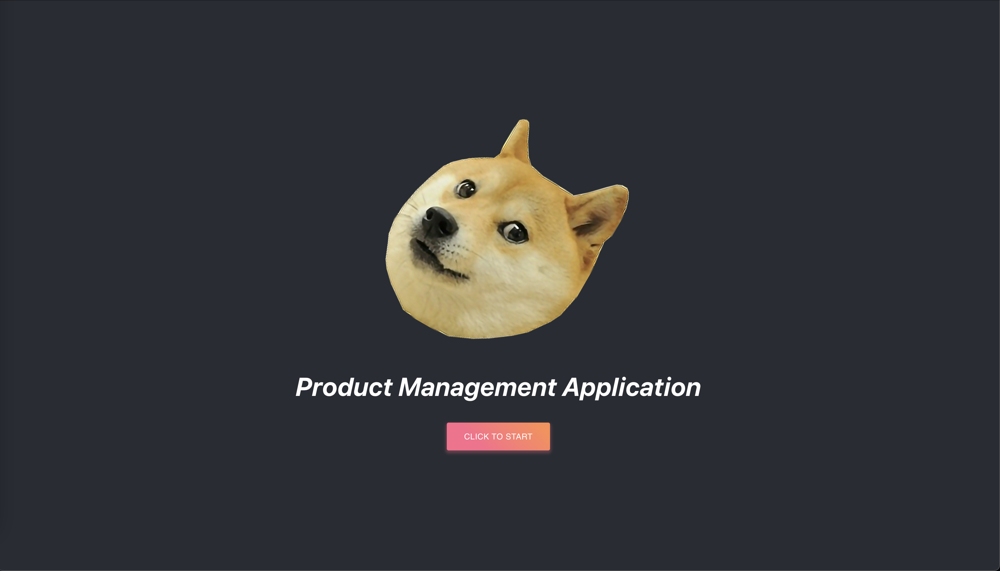
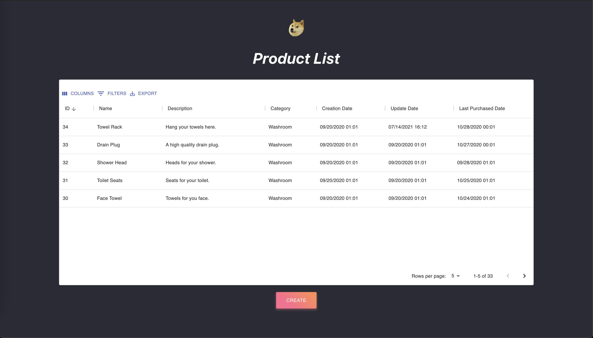
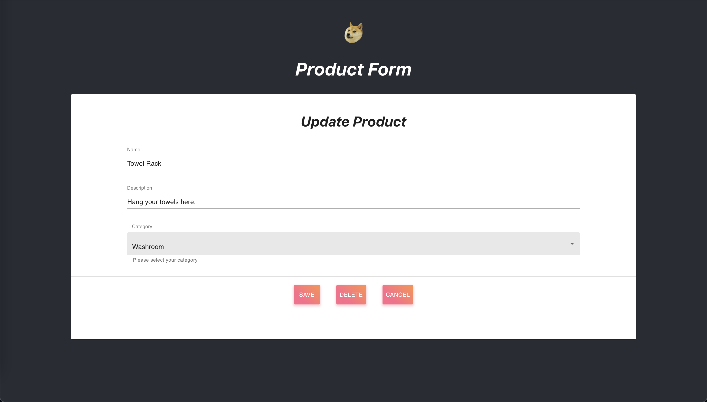
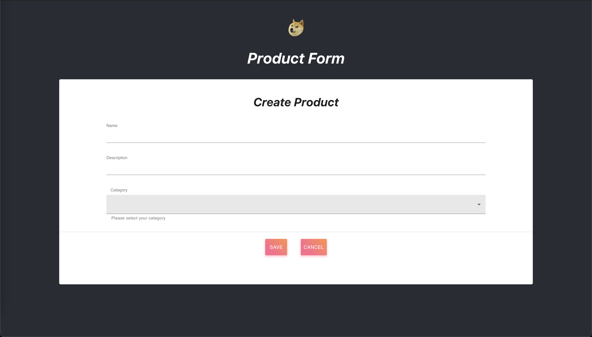
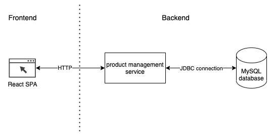
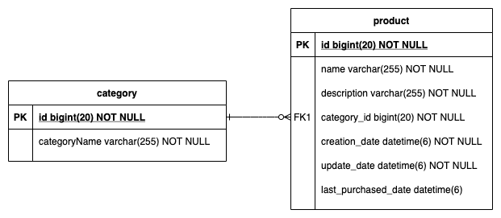

# Product Management Application
This is a simple product management application. This project contains everything you need. It includes
1. `frontend/gocity-product-management`: React SPA
2. `backend/gocity`: Spring Boot application which contains two sets of REST API, **Product API** and **Category API**.
3. `backend/gocity-database`: MySQL Database configuration

I use Docker to run all the components, including the frontend portal, check out [How to Run](#how-to-run) for more details. After spinning up all the containers, you can access the applicaiton via:

Frontend: `http://127.0.0.1:3000`

Backend: `http://127.0.0.1:8080/<endpoint>`

<br>

## Table of Contents
1. [Development Environment](#dev-env)
2. [Technologies Used](#technologies-used)
3. [Folder Structure](#this-folder)
4. [How to Run](#how-to-run)
5. [User Interface](#ui)
6. [System Architecture and Data Model](#system-architecture)
7. [Frontend Portal File Structure](#frontend-portal)
8. [Backend Service File Structure](#backend-service)
9. [Logging](#logging)
10. [Category API](#category-api)
11. [Product API](#product-api)
12. [Future Development](#future-development)

<br>

## Development Environment <a name="dev-env"></a>
I use the following tools for the development.

IDE: Visual Studio Code

OS: macOS Big Sur v11.1

<br>

## Technologies Used <a name="technologies-used"></a>

### Backend
1. Java 11
2. Spring Boot 2.5.2
3. Gradle 7.1.1

### Frontend
1. Node.js v12.14.1
2. React v17.0.2

### Database
1. MySQL 5.7

### Infrastructures
1. Docker
2. Docker Compose

<br>

## Folder structure <a name="this-folder"></a>

The following shows the structure of this folder. There are 3 subfolders:
1. backend

    (a) **gocity**: Backend service for this application. It contains all the source code, Dockerfile, docker-compose files, etc.  
    (b) **gocity-database**: It contains a docker-compose file of the database.

2. doc: All the assets related to this document.

3. frontend

    (a) **gocity-product-management**: React project for this application.


```
.
├── README.md
├── backend
│   ├── gocity
│   └── gocity-database
├── doc
│   ├── create-product.png
│   ├── gocity-architecture-diagram.png
│   ├── gocity-er-diagram.png
│   ├── landing.png
│   ├── product-details.png
│   └── product-list.png
└── frontend
    └── gocity-product-management
```

<br>

## How to Run <a name="how-to-run"></a>
### Please make sure the followings before running the application:
1. Docker and Docker Compose are installed on your machine.
2. Port 3000, 3306 and 8080 are available on your machine.

### Start the database
1. `cd backend/gocity-database`
2. `docker-compose build && docker-compose up -d`
3. (Stop) `docker-compose.yml up -d`

### Start the backend service
1. `cd backend/gocity`
2. `docker-compose build && docker-compose up -d`
3. (Stop) `docker-compose.yml up -d`

### Start the frontend portal
1. `cd frontend/gocity-product-management`
2. `docker-compose -f docker-compose-prod.yml build && docker-compose -f docker-compose-prod.yml up -d`
3. (Stop) `docker-compose-prod.yml up -d`

<br>

## User Interface <a name="ui"></a>

The following shows the user interface for this application.

### Landing Page

* path: `/`




### Product List

* path: `/secure/products`




### Product Details

* path: `/secure/products/:id`




### Create Product

* path: `/secure/products/create`



<br>

## System Architecture and Data Model <a name="system-architecture"></a>
The following picture shows the high level system architecture. Product management service (this service) manage the product data and product categories. Product management service exposes the `Product API` and `Category API` to the frontend portals. Data is stored in a MySQL database.



In our scenario, we have to types of data, `category` and `product`. Since each `product` must have a `category`, there is a **one-to-many relationship** between `product` and `category`. Because of this relationship, I decided to use a relational database, MySQL, as our data persistence layer. The following picture is the entity-relationship diagram for our database.



Each table has a `id`, which is the primary key. The `product` table has a foreign key (**FK1** in the picture) on column `category_id`, which is referencing the `id` in table `category`.

<br>

## Frontend Portal File Structure <a name="frontend-portal"></a>

The fronend portal is built using React. The following shows the file structure of the application. All the React source code is stored under the `src/main` folder. In most applications, authentication is required in order to gain access to the service(s). Therefore, I organize the source code as follows:

1. `src/main/common`: Stores the common components used across the application.
2. `src/main/public`: Stores the components used in public pages, which does not require authentication, such as landing page, signup, login, etc. 
3. `src/main/secure`: Stores the components used in private page, which requires authentication, such as product list, etc.
4. `src/main/util`: Stores the utility functions used across the application, such as `formatDate`, `httpGet`, etc.
```
.
├── Dockerfile
├── Dockerfile.prod
├── README.md
├── docker-compose-prod.yml
├── docker-compose.yml
├── package.json
├── public
│   ├── doge.png
│   ├── favicon.ico
│   ├── index.html
│   ├── logo192.png
│   ├── logo512.png
│   ├── manifest.json
│   └── robots.txt
├── src
│   ├── App.css
│   ├── App.js
│   ├── App.test.js
│   ├── index.css
│   ├── index.js
│   ├── logo.svg
│   ├── main
│   │   ├── common
│   │   ├── public
│   │   ├── secure
│   │   └── utils
│   ├── reportWebVitals.js
│   ├── setupTests.js
│   ├── static
│   │   └── doge.png
│   └── test
│       ├── common
│       ├── public
│       ├── secure
│       └── utils
└── yarn.lock
```

<br>

## Backend Service File Structure  <a name="backend-service"></a>

The following tree shows the file structure under the `src` folder. There are 5 packages `com.dennis.gocity`

1. **Data Transfer Object (DTO)**: Representation of business objects (Product and Category)
2. **Controller**: Implementation of the API endpoints
3. **Service**: Implemenatation of the business logics
4. **Repository**: Implemenatation of database queries. We only use Spring's default CrudRepository implementation in the project.
5. **Entity**: JPA entities that are persisted to the database.

```
src
├── main
│   ├── java
│   │   └── com
│   │       └── dennis
│   │           └── gocity
│   │               ├── GocityApplication.java
│   │               ├── controller
│   │               ├── dto
│   │               ├── entity
│   │               ├── repository
│   │               └── service
│   └── resources
│       ├── application.properties
│       ├── static
│       └── templates
└── test
    └── java
        └── com
            └── dennis
                └── gocity
                    ├── GocityApplicationTests.java
                    ├── controller
                    ├── dao
                    ├── entity
                    ├── repository
                    └── service
```

<br>

## Logging <a name="logging"></a>
I used SLF4J for logging. The log is store under `~/datadrive/gocity/backend/log`. The path can be updated by modifying the docker-compose file inside `backend/gocity`.


<br>

## Category API <a name="category-api"></a>

### **Get all categories**
Returns a list of category objects in JSON format.

* **URL**

  `/categories`

* **Method:**

  `GET`
  
*  **URL Params**

    None

* **Data Params**

    None

* **Success Response:**

  * **Code:** 200 <br />
    **Content:** 
    ```json
    [
        { 
            "id" : 1, 
            "categoryName" : "Example Category" 
        }
    ]
    ```
 
* **Error Response:**

  * **Code:** 500 INTERNAL SERVER ERROR <br />
    **Content:** `null`


### **Get category by ID**
Returns a category object in JSON format.

* **URL**

  `/categories/:id`

* **Method:**

  `GET`
  
*  **URL Params**

   **Required:**
 
   `id=[integer]`

* **Data Params**

    None

* **Success Response:**

  * **Code:** 200 <br />
    **Content:** 
    ```json
    { 
        "id" : 1, 
        "categoryName" : "Example Category" 
    }`
    ```
 
* **Error Response:**

  * **Code:** 500 INTERNAL SERVER ERROR <br />
    **Content:** `null`


### **Create category**
Insert a category entry in the database and returns a category object in JSON format. `id` is generated automatically during the insert operation.

* **URL**

  `/categories`

* **Method:**

  `POST`
  
*  **URL Params**

    None

* **Data Params**

    ```json
    {
        "categoryName": "Example Category"
    }
    ```

* **Success Response:**

  * **Code:** 200 <br />
    **Content:** 
    ```json
    { 
        "id" : 1, 
        "categoryName" : "Example Category" 
    }
    ```
 
* **Error Response:**

  * **Code:** 500 INTERNAL SERVER ERROR <br />
    **Content:** `null`


### **Update category**
Update a category entry in the database and returns a category object in JSON format.

* **URL**

  `/categories/:id`

* **Method:**

  `PUT`
  
*  **URL Params**

    **Required:**
 
   `id=[integer]`


* **Data Params**

    ```json
    {
        "id": 1,
        "categoryName": "Example Category Updated"
    }
    ```

* **Success Response:**

  * **Code:** 200 <br />
    **Content:** 
    ```json
    {
        "id" : 1, 
        "categoryName" : "Example Category Updated" 
    }
    ```
 
* **Error Response:**

  * **Code:** 500 INTERNAL SERVER ERROR <br />
    **Content:** `null`


### **Delete category**
Delete a category entry in the database and returns the `id` of the deleted entry as an integer.

* **URL**

  `/categories/:id`

* **Method:**

  `DELETE`
  
*  **URL Params**

    **Required:**
 
   `id=[integer]`


* **Data Params**

    None

* **Success Response:**

  * **Code:** 200 <br />
    **Content:** `1`
 
* **Error Response:**

  * **Code:** 500 INTERNAL SERVER ERROR <br />
    **Content:** `null`

<br>

## Product API <a name="product-api"></a>


### **Get all products**
Returns a list of product objects in JSON format.

* **URL**

  `/products`

* **Method:**

  `GET`
  
*  **URL Params**

    None

* **Data Params**

    None

* **Success Response:**

  * **Code:** 200 <br />
    **Content:** 
    ```json
    [
        {
            "id": 1,
            "name": "Example Product",
            "description": "Example product description",
            "category": {
                "id": 1,
                "categoryName": "Example Category"
            },
            "creationDate": "2021-07-13T16:41:15.388+00:00",
            "updateDate": "2021-07-13T16:41:15.388+00:00",
            "lastPurchasedDate": null
        }
    ]
    ```
 
* **Error Response:**

  * **Code:** 500 INTERNAL SERVER ERROR <br />
    **Content:** `null`


### **Get product by ID**
Returns a product object in JSON format.

* **URL**

  `/products/:id`

* **Method:**

  `GET`
  
*  **URL Params**

   **Required:**
 
   `id=[integer]`

* **Data Params**

    None

* **Success Response:**

  * **Code:** 200 <br />
    **Content:** 
    ```json
    {
        "id": 1,
        "name": "Example Product",
        "description": "Example product description",
        "category": {
            "id": 1,
            "categoryName": "Example Category"
        },
        "creationDate": "2021-07-13T16:41:15.388+00:00",
        "updateDate": "2021-07-13T16:41:15.388+00:00",
        "lastPurchasedDate": null
    }
    ```
 
* **Error Response:**

  * **Code:** 500 INTERNAL SERVER ERROR <br />
    **Content:** `null`


### **Purchase product**
Returns a product object in JSON format.

* **URL**

  `/products/:id/purchase`

* **Method:**

  `POST`
  
*  **URL Params**

   **Required:**
 
   `id=[integer]`

* **Data Params**

    ```json
    {
        "id": 1,
        "name": "Knife Set",
        "description": "A set of knives in all shapes and sizes.",
        "category": {
            "id": 1,
            "categoryName": "Kitchen"
        },
        "creationDate": "2020-09-20T00:01:00.000+00:00",
        "updateDate": "2020-09-20T00:01:00.000+00:00",
        "lastPurchasedDate": "2020-10-24T00:01:00.000+00:00"
    }
    ```

* **Success Response:**

  * **Code:** 200 <br />
    **Content:** 
    ```json
    {
        "id": 1,
        "name": "Example Product",
        "description": "Example product description",
        "category": {
            "id": 1,
            "categoryName": "Example Category"
        },
        "creationDate": "2021-07-13T16:41:15.388+00:00",
        "updateDate": "2021-07-13T16:41:15.388+00:00",
        "lastPurchasedDate": "2021-07-13T16:41:15.388+00:00"
    }
    ```
 
* **Error Response:**

  * **Code:** 500 INTERNAL SERVER ERROR <br />
    **Content:** `null`


### **Create product**
Insert a product entry in the database and returns a product object in JSON format. `id` is generated automatically during the insert operation.

* **URL**

  `/products`

* **Method:**

  `POST`
  
*  **URL Params**

    None

* **Data Params**

    ```json
    {
        "name": "Example Product",
        "description": "Example Product Description",
        "category": {
            "id": 1,
            "categoryName": "Example Category"
        }
    }
    ```

* **Success Response:**

  * **Code:** 200 <br />
    **Content:** 
    ```json
    {
        "id": 1,
        "name": "Example Product",
        "description": "Example Product Description",
        "category": {
            "id": 1,
            "categoryName": "Example Category"
        },
        "creationDate": "2021-07-13T16:41:15.388+00:00",
        "updateDate": "2021-07-13T16:41:15.388+00:00",
        "lastPurchasedDate": null
    }
    ```
 
* **Error Response:**

  * **Code:** 500 INTERNAL SERVER ERROR <br />
    **Content:** `null`


### **Update product**
Update a product entry in the database and returns a product object in JSON format.

* **URL**

  `/products/:id`

* **Method:**

  `PUT`
  
*  **URL Params**

    **Required:**
 
   `id=[integer]`


* **Data Params**

    ```json
    {
        "id": 1,
        "name": "Example Product Updated",
        "description": "Example Product Description Updated",
        "category": {
            "id": 1,
            "categoryName": "Example Category"
        }
    }
    ```

* **Success Response:**

  * **Code:** 200 <br />
    **Content:** 
    ```json
    {
        "id": 1,
        "name": "Example Product Updated",
        "description": "Example Product Description Updated",
        "category": {
            "id": 1,
            "categoryName": "Example Category"
        },
        "creationDate": "2021-07-13T16:41:15.388+00:00",
        "updateDate": "2021-07-13T16:41:15.388+00:00",
        "lastPurchasedDate": "2021-07-13T16:41:15.388+00:00"
    }
    ```
 
* **Error Response:**

  * **Code:** 500 INTERNAL SERVER ERROR <br />
    **Content:** `null`


### **Delete product**
Delete a product entry in the database and returns the `id` of the deleted entry as an integer.

* **URL**

  `/products/:id`

* **Method:**

  `DELETE`
  
*  **URL Params**

    **Required:**
 
   `id=[integer]`


* **Data Params**

    None

* **Success Response:**

  * **Code:** 200 <br />
    **Content:** `1`
 
* **Error Response:**

  * **Code:** 500 INTERNAL SERVER ERROR <br />
    **Content:** `null`

<br>

## Future Development <a name="future-development"></a>
1. (Backend) Implement authentication layer using `Spring Security`
2. (UI Improvement) Transform the existing landing page into a login page
3. (UI Improvement) Support category management
4. (UI Improvement) Add navigation bar and side bar
5. ...
